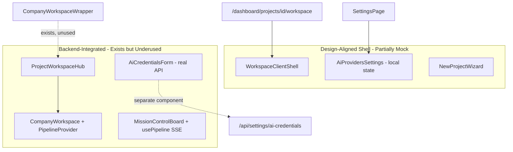
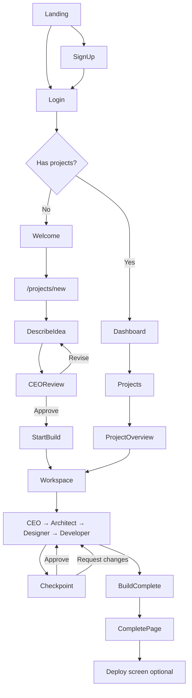

# HibirDev AI — Full Design-to-Production Implementation Plan

## Research Summary

### Design assets inventory

All reference designs live in [`desing/`](desing/) (gitignored). Each screen folder contains `code.html` + `screen.png`. Additional dashboard states exist in [`stitch_hibirdev_ai_login_experience.zip`](../stitch_hibirdev_ai_login_experience.zip) (parent directory).

**29 HTML mockups found:**

| Group | Screens |
|-------|---------|
| **Onboarding** (8) | `step_01_define`, `step_02_understand`, `step_03_prepare`, `step_04_launch`, `ai_processing_state`, `revision_state` (+ mobile variant for step 01) |
| **Dashboard** (2) | `dashboard_loading_state` desktop/mobile |
| **Mission / Workspace** (6) | `mission_control_desktop/mobile`, `action_required`, `artifacts_registry`, `system_architecture`, `workspace_error` |
| **Checkpoint + Settings** (13) | 8 checkpoint states + AI providers, connect form, security, workspace access |

**Design system tokens:** [`desing/hibirdev_ai_core/DESIGN.md`](desing/hibirdev_ai_core/DESIGN.md) and [`desing/technical_precision_1/DESIGN.md`](desing/technical_precision_1/DESIGN.md) define **Technical Precision** — dark graphite surfaces, `#00ACAC` teal accent, Inter + JetBrains Mono, 1px blueprint grid lines, no glass/blur.

**Missing design HTML (must derive from your screen spec + existing components):**
Screens 01–03 (Landing, Login, Sign Up), Screen 04 (Welcome), Screens 13–16 (individual agent workspace states as distinct layouts), Screen 23 (Completed Project), Screen 24 (Deployment).

### Current codebase state

The backend is **substantially complete** — 130+ API routes, pipeline SSE, proposal/architecture approval, workspace, deployment, AI credentials. Tests pass (137 agent/scenario tests per [`12_CURRENT_TASK.md`](doc/project-docs/12_CURRENT_TASK.md)).

The frontend has **two parallel UI layers**:



**Critical gap:** [`src/app/dashboard/projects/[id]/workspace/page.tsx`](src/app/dashboard/projects/[id]/workspace/page.tsx) renders mock [`WorkspaceClientShell`](src/features/workspace/components/workspace-client-shell.tsx) (hardcoded StudyMate file tree) instead of [`CompanyWorkspaceWrapper`](src/app/dashboard/projects/[id]/workspace/company-workspace-wrapper.tsx) which wraps the real [`ProjectWorkspaceHub`](src/features/workspace/components/project-workspace-hub.tsx) + [`CompanyWorkspace`](src/features/workspace/components/company-workspace.tsx) with live pipeline SSE.

**Settings gap:** [`AiProvidersSettings`](src/features/settings/components/ai-providers-settings.tsx) uses hardcoded provider state; [`AiCredentialsForm`](src/features/settings/components/ai-credentials-form.tsx) already calls `/api/settings/ai-credentials` correctly but is not the default settings page.

**Auth/onboarding gap:** Signup redirects to login ([`signup-form.tsx`](src/components/auth/signup-form.tsx)); no Welcome screen; `/projects/new` is unprotected in [`proxy.ts`](src/proxy.ts).

**Token alignment:** [`globals.css`](src/app/globals.css) already uses Technical Precision palette — close match to design HTML. [`08_DESIGN_SYSTEM.md`](doc/project-docs/08_DESIGN_SYSTEM.md) still documents outdated "Yacht Club" palette and needs updating.

---

## Target architecture

### Route map (screens → routes, not 32 separate pages)

Treat workspace agent states (13–17) and checkpoint states (18–22) as **state machines inside shared shells**, per your spec.

| Phase | Screen(s) | Route | Shell component |
|-------|-----------|-------|-----------------|
| Public | 01 Landing | `/` | `LandingPage` |
| Public | 02 Login / 03 Sign Up | `/login`, `/signup` | `AuthShell` |
| First-time | 04 Welcome | `/welcome` | `WelcomeSetup` (new) |
| First-time | 05–08 Onboarding | `/projects/new` | `OnboardingWizard` (refactor from `NewProjectWizard`) |
| Main | 09 Dashboard | `/dashboard` | `DashboardPage` |
| Main | 10 Projects | `/dashboard/projects` | `ProjectsPage` |
| Main | 11 Project Overview | `/dashboard/projects/[id]` | `ProjectOverviewPage` (refactor) |
| Build | 12–17 Workspace | `/dashboard/projects/[id]/workspace` | `ProjectWorkspaceHub` |
| Control | 18–22 Checkpoint | same route, overlay state | `CheckpointReviewPanel` |
| Complete | 23–24 Done/Deploy | `/dashboard/projects/[id]/complete` | `ProjectCompletePage` |
| Settings | 25–32 | `/dashboard/settings/*` | `SettingsLayout` + section pages |

### Persistent nav (logged in)

Match your simplified model — replace current [`nav-items.ts`](src/components/layout/nav-items.ts):

```
Dashboard
Projects
  └─ [Current Project] → Workspace (contextual, when project active)
Settings
Account (user menu)
```

Move AI Teams, Mission Control, Artifacts, Architecture to **project-context subnav** inside workspace/project overview, not top-level.

### User journey flow



---

## Implementation phases

### Phase 0 — Design system foundation (1–2 days)

**Goal:** Single source of truth matching `desing/hibirdev_ai_core/DESIGN.md`.

- Extract design tokens from [`DESIGN.md`](desing/hibirdev_ai_core/DESIGN.md) into [`src/packages/theme/`](src/packages/theme/) (or extend [`globals.css`](src/app/globals.css)):
  - Material-style surface tokens (`surface-container-low`, `outline-variant`, etc.) used in HTML mockups
  - Typography scale: `display-lg`, `headline-md`, `label-sm`, `code-md`
  - Spacing: 4px grid, `grid-line: 0.5px`
- Create shared layout primitives in `src/components/design-system/`:
  - `BlueprintGrid`, `AppShell`, `SideNav`, `TopBar`, `PanelDivider`, `StatusChip`, `AgentPipelineBar`, `MonoLabel`
- Remove conflicting glassmorphism utilities where they clash with design spec (keep only where design HTML uses them — most do not)
- Update [`08_DESIGN_SYSTEM.md`](doc/project-docs/08_DESIGN_SYSTEM.md) to Technical Precision (stop Yacht Club drift)

**Reference HTML for token extraction:** any `code.html` tailwind config block (e.g. [`onboarding_step_01_define_desktop/code.html`](desing/hibirdev_ai_onboarding_step_01_define_desktop/code.html))

---

### Phase 1 — Public entry screens (2–3 days)

**Screens 01–03.** No HTML mockups exist — rebuild from your spec + existing [`landing-sections.tsx`](src/components/landing/landing-sections.tsx) and [`auth-shell.tsx`](src/components/auth/auth-shell.tsx).

| Section | Work |
|---------|------|
| **01 Landing** | Add missing sections: product visualization, four-agent explanation, benefits, trust/proof, full footer. Match Technical Precision grid layout. CTA → `/signup` |
| **02 Login** | States: normal, invalid credentials, loading, success. Wire to NextAuth. Redirect: existing user → `/dashboard`; first-time → `/welcome` (check project count via `/api/projects`) |
| **03 Sign Up** | States: validation, creating, success. After register → auto-login OR redirect to login with `?next=/welcome` |

Extract dashboard interaction patterns from zip (`dashboard_active_workspace_desktop`, `dashboard_new_workspace_empty_state`) for Phase 2.

---

### Phase 2 — First-time user onboarding (3–4 days)

**Screens 04–08.** Primary design reference: 8 onboarding HTML folders.

Refactor [`NewProjectWizard`](src/features/projects/components/new-project-wizard.tsx) into a state-machine wizard at [`/projects/new`](src/app/projects/new/page.tsx):

| Step | Design reference | Backend integration |
|------|-----------------|---------------------|
| 04 Welcome | New component | None — orientation only |
| 05 Create Project | `step_01_define` | `POST /api/projects` (name only) |
| 06 Describe Idea | `step_01_define` textarea | `PATCH /api/projects/[id]` or store in wizard state |
| 07 CEO Review | `step_02_understand` | `GET/POST /api/projects/[id]/proposal`, `approve`, `update` |
| 08 Confirm & Start | `step_03_prepare`, `step_04_launch`, `ai_processing_state` | `POST /api/projects/[id]/pipeline/approve`, redirect to workspace |

Handle revision loop using `revision_state` design + `POST /api/projects/[id]/proposal/update`.

**Auth hardening:** Add `/projects/new`, `/welcome` to [`proxy.ts`](src/proxy.ts) protected prefixes.

**Post-signup routing:** New users with 0 projects → `/welcome` → `/projects/new`. Returning users → `/dashboard`.

---

### Phase 3 — Main application shell (3–4 days)

**Screens 09–11.**

#### 09 Dashboard
Reference: `dashboard_loading_state_*` + zip dashboard screens.

Refactor [`dashboard/page.tsx`](src/app/dashboard/page.tsx):
- Loading skeleton matching design
- Sections: Active Builds, Recent Activity, Attention Required, project cards with status badges (`BUILDING`, `COMPLETED`)
- Wire [`dashboard.service.ts`](src/features/dashboard/services/dashboard.service.ts) — already used
- Empty state from zip `dashboard_new_workspace_empty_state`

#### 10 Projects
Refactor [`dashboard/projects/page.tsx`](src/app/dashboard/projects/page.tsx):
- Search, filter by status, archive action
- Project cards matching design density

#### 11 Project Overview
Refactor [`dashboard/projects/[id]/page.tsx`](src/app/dashboard/projects/[id]/page.tsx):
- Replace tab-heavy [`project-tabs-client.tsx`](src/app/dashboard/projects/[id]/project-tabs-client.tsx) with overview-first layout
- Show: project status, 4-agent pipeline bar, current task, artifacts list, recent activity
- CTAs: **Open Workspace**, **View Artifacts**
- Pipeline data from `GET /api/projects/[id]/pipeline/status`

---

### Phase 4 — Workspace shell + agent states (5–7 days) — HIGHEST PRIORITY

**Screens 12–17.**

#### 4a. Swap mock workspace for integrated hub

In [`workspace/page.tsx`](src/app/dashboard/projects/[id]/workspace/page.tsx):

```tsx
// Replace WorkspaceClientShell with:
<CompanyWorkspaceWrapper
  projectId={project.id}
  projectName={project.name}
  projectDescription={project.description ?? ''}
  userName={session.user.name ?? 'User'}
/>
```

Delete or deprecate mock content in [`workspace-client-shell.tsx`](src/features/workspace/components/workspace-client-shell.tsx) after migration.

#### 4b. Restyle CompanyWorkspace to match design HTML

Reference: [`mission_control_desktop/code.html`](desing/mission desing/hibirdev_ai_mission_control_desktop/code.html)

[`CompanyWorkspace`](src/features/workspace/components/company-workspace.tsx) already has:
- Pipeline SSE via [`use-pipeline.ts`](src/features/workspace/hooks/use-pipeline.ts)
- Approve / request changes
- Mission Control + Studio mode toggle

Restyle to match design:
- Left: project + pipeline bar (CEO ✓ / Architect ● / Designer ○ / Developer ○)
- Center: agent-specific content panel
- Right: artifacts + activity
- Mobile: [`mission_control_mobile`](desing/mission desing/hibirdev_ai_mission_control_mobile/code.html) drawer pattern

#### 4c. Agent state panels (same route, conditional render)

Map `currentPhase` from pipeline to panel content:

| State | Phase key | Primary artifact | Panel |
|-------|-----------|------------------|-------|
| 13 Initial | pre-start | — | Start CTA |
| 14 CEO | `discovery` / `strategy` | Product Specification | Document viewer |
| 15 Architect | `architecture` | Architecture Spec | [`SystemArchitecture`](src/features/architecture/components/system-architecture.tsx) |
| 16 Designer | `design` | Design Specification | Design spec viewer |
| 17 Developer | `development` | Code | Studio mode: Monaco + file explorer + terminal |
| 17 Complete | `completed` | All | Build complete banner |

Developer state activates [`ProjectWorkspaceHub`](src/features/workspace/components/project-workspace-hub.tsx) Studio view (Monaco, explorer, terminal already exist in [`features/workspace/`](src/features/workspace/)).

#### 4d. Error + action states

- `action_required` → [`ActionRequiredBanner`](src/features/workspace/components/action-required-banner.tsx)
- `workspace_error` → error state component with retry via `pipeline.refresh()`

---

### Phase 5 — Checkpoint review flow (3–4 days)

**Screens 18–22.**

Reference: all 8 screens in [`desing/setting and approval/hibirdev_ai_checkpoint_*`](desing/setting%20and%20approval/)

Build `CheckpointReviewPanel` (full-page or split-pane overlay) replacing lightweight [`CheckpointApprovalDock`](src/features/workspace/components/checkpoint-approval-dock.tsx):

| State | Design reference | Backend |
|-------|-----------------|---------|
| 18 Waiting | `action_required` | `approvalRequests` from pipeline SSE |
| 19 Document review | `checkpoint_approval_normal` | `pendingDocument` from pipeline |
| 20 Validation | `checkpoint_approval_issues_detected`, `blocked_failed_checks` | [`design-reviewer.ts`](src/core/design-review/design-reviewer.ts) via new API or existing review pipeline |
| 21 Request changes | `checkpoint_approval_request_changes`, `revision_requested_success` | `pipeline.requestChanges()` → `/api/projects/[id]/proposal/update` or architecture reject |
| 22 Approved | `checkpoint_approved_success`, `checkpoint_already_approved` | `pipeline.approve()` → `/api/projects/[id]/proposal/approve` or `/architecture/approve` |

Layout: split pane (artifact left, review/validation/actions right) exactly as spec.

Integrate [`design-review`](src/core/design-review/) engine for validation checklist (required sections, responsive, accessibility, component states).

---

### Phase 6 — Project completion + deployment (2–3 days)

**Screens 23–24.**

New route: `/dashboard/projects/[id]/complete`

- Show full pipeline ✓, artifact summary, implementation status
- Actions: Open Application (`/preview/[projectId]`), Open Workspace, View Artifacts
- **Screen 24 (conditional):** Wire [`DeploymentPanel`](src/features/deployment/components/deployment-panel.tsx) + [`deployment.service.ts`](src/features/deployment/services/deployment.service.ts) — backend exists; include if deployment APIs are stable in your environment

Trigger redirect to complete page when `phaseStatus === 'completed'` in pipeline.

---

### Phase 7 — Settings (2–3 days)

**Screens 25–32.**

Replace mock [`AiProvidersSettings`](src/features/settings/components/ai-providers-settings.tsx) with design-styled wrapper around real [`AiCredentialsForm`](src/features/settings/components/ai-credentials-form.tsx):

| Screen | Route | Backend | Notes |
|--------|-------|---------|-------|
| 25 Overview | `/dashboard/settings` | — | [`SettingsNavTabs`](src/features/settings/components/settings-nav-tabs.tsx) |
| 26–28 AI Providers | same | `/api/settings/ai-credentials`, `/test` | Match `settings_ai_providers_desktop`, `connect_provider_form` |
| 29 Workspace | `/dashboard/settings/workspace` (new) | org/project prefs API | Only if fields exist in DB |
| 30 Access | `/dashboard/settings/access` | existing RBAC | Keep — already exists |
| 31 Security | `/dashboard/settings/security` | sessions/audit API | Match `settings_security_connection_states` |
| 32 Account | `/dashboard/settings/account` | `/api/users/me` | [`profile-form.tsx`](src/features/settings/components/profile-form.tsx) |

---

### Phase 8 — Production hardening (2–3 days)

- **Route protection:** Extend [`proxy.ts`](src/proxy.ts) for `/projects/new`, `/welcome`, `/workspace/*`
- **Remove dead code:** deprecate mock `WorkspaceClientShell`, unused `/workspace/[projectId]` demo route (or redirect to dashboard workspace)
- **Consolidate creation flows:** Single onboarding path at `/projects/new`; `/dashboard/projects/new` redirects there
- **Loading/error boundaries:** Match design loading states on every route
- **Responsive:** Implement mobile variants for onboarding, dashboard, workspace, checkpoint (design PNGs exist)
- **Build verification:** `npm run build`, `tsc --noEmit`, `vitest run`
- **E2E smoke:** Extend [`tests/e2e/end-to-end-project-lifecycle.test.ts`](tests/e2e/end-to-end-project-lifecycle.test.ts) to cover full UI journey
- **Performance:** Lazy-load Monaco/Sandpack (already dynamic in hub)
- **SEO/metadata:** Consistent `HibirDev AI` titles (partially done)

---

## File change map (key files)

| Action | File |
|--------|------|
| **Replace** | [`src/app/dashboard/projects/[id]/workspace/page.tsx`](src/app/dashboard/projects/[id]/workspace/page.tsx) |
| **Refactor** | [`src/features/projects/components/new-project-wizard.tsx`](src/features/projects/components/new-project-wizard.tsx) |
| **Restyle** | [`src/features/workspace/components/company-workspace.tsx`](src/features/workspace/components/company-workspace.tsx) |
| **New** | `src/features/checkpoint/components/checkpoint-review-panel.tsx` |
| **New** | `src/app/welcome/page.tsx` |
| **New** | `src/app/dashboard/projects/[id]/complete/page.tsx` |
| **Replace settings UI** | [`src/features/settings/components/ai-providers-settings.tsx`](src/features/settings/components/ai-providers-settings.tsx) |
| **Update nav** | [`src/components/layout/nav-items.ts`](src/components/layout/nav-items.ts), [`sidebar.tsx`](src/components/layout/sidebar.tsx) |
| **Update tokens** | [`src/app/globals.css`](src/app/globals.css), [`08_DESIGN_SYSTEM.md`](doc/project-docs/08_DESIGN_SYSTEM.md) |
| **Auth guard** | [`src/proxy.ts`](src/proxy.ts) |

---

## Design-to-screen crosswalk

| Your screen # | Design folder | Implementation status |
|---------------|---------------|----------------------|
| 01 Landing | — | Rebuild from spec |
| 02–03 Auth | — | Restyle existing |
| 04 Welcome | — | New page |
| 05–08 Onboarding | 8 HTML folders | Refactor wizard |
| 09 Dashboard | 2 + zip (6) | Restyle + wire |
| 10–11 Projects/Overview | mission_control partial | Refactor |
| 12–17 Workspace | mission_control, action_required | **Swap to CompanyWorkspace** |
| 18–22 Checkpoint | 8 HTML folders | New panel + wire pipeline |
| 23 Complete | — | New page |
| 24 Deploy | — | Wire existing deployment feature |
| 25–32 Settings | 5 HTML folders | Replace mock with API |

---

## Recommended execution order

Follow your design-generation sequence, but batch by shared shells:

1. **Phase 0** — tokens + shared components (blocks everything)
2. **Phase 4a** — swap workspace to real backend (**unblocks end-to-end testing immediately**)
3. **Phase 2** — onboarding (screens 04–08)
4. **Phase 1** — public entry (01–03)
5. **Phase 3** — dashboard/projects/overview (09–11)
6. **Phase 4b–c** — workspace visual polish + agent states (12–17)
7. **Phase 5** — checkpoint (18–22)
8. **Phase 6** — completion (23–24)
9. **Phase 7** — settings (25–32)
10. **Phase 8** — production hardening

Estimated total: **23–31 dev days** for one engineer, or **2–3 weeks** with parallel work on onboarding + workspace + settings.

---

## Risk mitigations

| Risk | Mitigation |
|------|------------|
| Two workspace implementations cause confusion | Phase 4a first — single source of truth |
| Settings mock data in production | Replace `AiProvidersSettings` before launch |
| Design HTML uses CDN Tailwind inline | Extract tokens once; do not copy HTML verbatim |
| 10-phase backend vs 4-agent UI | Map phases to CEO/Architect/Designer/Developer in [`use-pipeline.ts`](src/features/workspace/hooks/use-pipeline.ts) display layer |
| `/projects/new` unprotected | Fix in Phase 2 |
| Missing landing/auth designs | Use Technical Precision system + your written spec |
