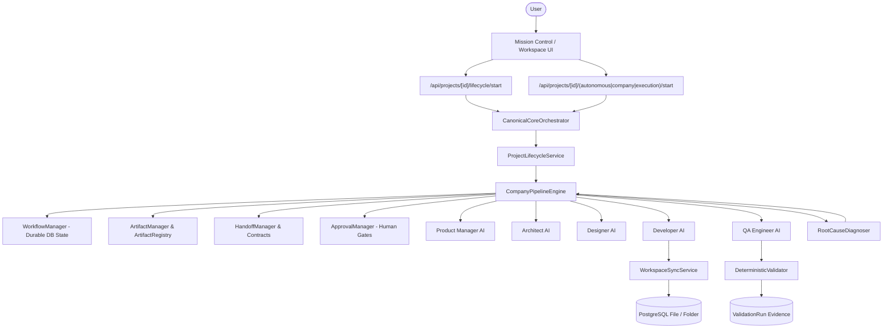
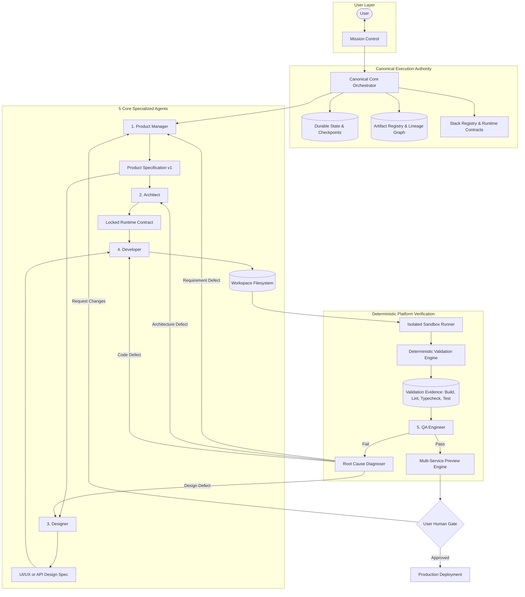

# AI Teams Platform: Comprehensive Architecture Assessment & Target Transformation Blueprint

**Role:** Chief Technology Officer (CTO) & Principal AI Systems Architect  
**Status:** COMPLETE — Architecture Assessment & Baseline Inventory  
**Date:** 2026-08-26  
**Repository:** `AI-Teams-Platform-Control/ai-teams-platform`

---

## 1. Executive Summary & Quality Principle

> **THE AI TEAMS QUALITY PRINCIPLE**  
> *Never optimize for the appearance of autonomy. Optimize for verified successful outcomes.*  
> The system must prefer:  
> `"Unable to complete — here is the exact failure and recovery path."`  
> over:  
> `"Completed successfully."`  
> when completion has not been objectively verified.

AI generates, reasons, and plans. The **platform** verifies, persists, controls, secures, and measures. A task is complete only when deterministic executable evidence proves it is complete.

This assessment provides a complete audit of the existing codebase across 12 inspection domains, analyzes architectural debt and duplication, defines the single canonical target architecture, and outlines an incremental, zero-regression transformation strategy.

---

## 2. Comprehensive Codebase Inventory (12 Inspection Domains)

### 2.1 Complete Repository Structure
```
ai-teams-platform/
├── prisma/
│   ├── schema.prisma               # 2,763 lines, 45+ Prisma models
│   └── migrations/                 # DB migrations history
├── src/
│   ├── ai/
│   │   ├── agents/
│   │   │   ├── core/               # Model routes, AI call wrapper, rate limiters
│   │   │   ├── roles/              # 5 Core Agent implementations + 11 specialized role subdirs
│   │   │   ├── memory/             # Agent memory manager
│   │   │   └── tools/              # Agent tool definitions
│   │   ├── providers/              # Gemini, Groq, OpenRouter, OpenAI adapters
│   │   └── router/                 # Model capability routing
│   ├── core/
│   │   ├── canonical-orchestrator/ # Single canonical execution authority facade
│   │   ├── company-orchestration/  # Primary 10-phase pipeline engine, handoffs, approvals
│   │   ├── execution-engine/       # Secondary pipeline orchestrator, task engine, budget
│   │   ├── company/                # Event-bus driven company orchestrator
│   │   ├── master-orchestrator/    # Standalone master orchestrator
│   │   ├── orchestrator/           # Phase-by-phase orchestrator engine
│   │   ├── artifacts/              # Artifact envelope registry & lineage graph
│   │   ├── deterministic-validation/# Objective build, lint, typecheck, test validator
│   │   ├── project-inspector/      # Repository file scanner & contract drift detector
│   │   ├── root-cause/             # Defect attribution & remediation routing
│   │   ├── runtime-contract/       # ProjectRuntimeContract persistence & service
│   │   ├── stack-registry/         # Verified technology stack profiles
│   │   ├── state/                  # Single source of truth project state manager
│   │   ├── tools/                  # Tool executor & permission registry
│   │   └── workspace/              # Workspace service & SSE pipeline updates
│   ├── features/
│   │   ├── ai-credentials/         # BYOK encrypted key storage & verification
│   │   ├── workspace/              # Explorer, Monaco editor, timeline, preview builder
│   │   ├── projects/               # Project creation, settings, lifecycle hooks
│   │   └── settings/               # User preferences & API key management
│   ├── lib/
│   │   ├── api-response.ts         # Unified API response envelope & HTTP error mapper
│   │   ├── encryption.ts           # AES-256-GCM BYOK credential encryption
│   │   └── prisma.ts               # Prisma client singleton
│   └── app/
│       ├── api/                    # 30+ Next.js App Router API endpoints
│       └── dashboard/              # Mission Control, Workspace, Studio, Settings UI
└── tests/                          # 105 test suites, 409 unit/integration/e2e/benchmark tests
```

---

### 2.2 All Orchestration Systems (5 Co-Existing Engines)
1. **`CompanyPipelineEngine`** ([`src/core/company-orchestration/company-pipeline.engine.ts`](file:///home/jabez/Documents/software/project/myproduct/AI-Teams-Platform-Control/ai-teams-platform/src/core/company-orchestration/company-pipeline.engine.ts)):
   - *Status:* **Active Primary Authority**. Powers Mission Control UI, SSE generation stream, approval gates, and timeline events.
2. **`PipelineOrchestrator`** ([`src/core/execution-engine/pipeline.orchestrator.ts`](file:///home/jabez/Documents/software/project/myproduct/AI-Teams-Platform-Control/ai-teams-platform/src/core/execution-engine/pipeline.orchestrator.ts)):
   - *Status:* Duplicate pipeline with task scheduler, token usage tracking, and budget manager.
3. **`CompanyOrchestrator`** ([`src/core/company/company-orchestrator.ts`](file:///home/jabez/Documents/software/project/myproduct/AI-Teams-Platform-Control/ai-teams-platform/src/core/company/company-orchestrator.ts)):
   - *Status:* Event-driven orchestrator using `company-event-bus.ts` and `company-checkpoint.service.ts`.
4. **`MasterOrchestrator`** ([`src/core/master-orchestrator/master-orchestrator.ts`](file:///home/jabez/Documents/software/project/myproduct/AI-Teams-Platform-Control/ai-teams-platform/src/core/master-orchestrator/master-orchestrator.ts)):
   - *Status:* Standalone sequential pipeline engine.
5. **`OrchestratorEngine`** ([`src/core/orchestrator/orchestrator.engine.ts`](file:///home/jabez/Documents/software/project/myproduct/AI-Teams-Platform-Control/ai-teams-platform/src/core/orchestrator/orchestrator.engine.ts)):
   - *Status:* Phase execution engine with static phase routing.

---

### 2.3 Agent Implementations (The 5 Core Roles vs Role Proliferation)
- **The 5 Canonical Roles:**
  1. **Product Manager (PM)**: Discovery, problem clarification, user stories, acceptance criteria, non-goals, project intent classification.
  2. **Architect**: Stack selection, runtime contract locking, API contracts, database schema, task dependency graph.
  3. **Designer**: UI/UX design tokens, component specifications (frontend) or API/DX usability contracts (backend/API).
  4. **Developer**: Incremental, task-bounded real file edits against workspace; no mock fallbacks on provider failure.
  5. **QA Engineer**: Consumes deterministic build/lint/test execution evidence + requirements coverage with root cause diagnosis.
- **Specialized / Ancillary Roles:**
  - 11 specialized sub-agents (`ceo`, `business-analyst`, `devops`, `security`, `database`, `frontend`, `backend`, `ux-researcher`, `quality-reviewer`, `architecture-reviewer`, `code-reviewer`).
  - *Assessment:* These must operate strictly as specialized sub-capabilities invoked by the 5 canonical agents, never as independent competing pipeline authorities.

---

### 2.4 State Models & Database Persistence
- **`Project`**: Core project metadata, `selectedStackId`, `selectedStackVersion`, `projectType`, `runtimeContract` (JSON), `capabilities` (JSON).
- **`Mission`**: Unit of work (`id`, `projectId`, `title`, `status`, `currentPhase`, `checkpoint`, `attempt`, `budgetUsd`, `usedTokens`, `usedCostUsd`).
- **`ProjectWorkflowState`**: Durable execution state (`currentPhase`, `completedPhases`, `activeAgent`, `currentArtifact`, `progress`, `waitingApprovals`, `metadata`).
- **`ApprovalHistory`**: Human decision records (`approvalType`, `status`, `phase`, `comments`, `reviewedBy`).
- **`ArtifactLifecycleRecord`**: Persisted artifact tracking (`artifactType`, `artifactId`, `producerRole`, `consumerRoles`, `version`, `status`).
- **`ValidationRun`**: Executable evidence (`command`, `exitCode`, `stdout`, `stderr`, `durationMs`, `passed`, `evidence`, `rootCause`).
- **`Repository` / `File` / `Folder`**: PostgreSQL-backed workspace virtual filesystem.
- **`UserAiCredential`**: Encrypted API keys (AES-256-GCM).

---

### 2.5 In-Memory State & Leakage Points
| In-Memory Variable | Location | Risk | Target Resolution |
| :--- | :--- | :--- | :--- |
| `runningProjects: Map<string, number>` | `company-pipeline.engine.ts` | Execution lock lost on serverless warm start/crash | Persist lock lease & heartbeat to `ProjectWorkflowState.metadata.executionLock` |
| `builds: Map<string, BuildState>` | `developer.service.ts` | Active build progress lost on restart | Persist active task index & progress to `ProjectWorkflowState.metadata.buildProgress` |
| `inMemoryArtifacts: Map<string, ArtifactEnvelope[]>` | `artifact-registry.service.ts` | Transient cache | Fall back to `document` / `artifact_lifecycle_records` in PostgreSQL |

---

### 2.6 Preview & Sandbox Execution
- **Preview System** ([`src/features/workspace/preview/services/preview-builder.service.ts`](file:///home/jabez/Documents/software/project/myproduct/AI-Teams-Platform-Control/ai-teams-platform/src/features/workspace/preview/services/preview-builder.service.ts)):
  - Fast Mode: Babel in-browser standalone transpilation + Tailwind CDN.
  - Full Mode: WebContainer multi-service node runner.
  - Static Mode: Plain HTML/CSS iframe rendering.
- **Validation Engine** ([`src/core/deterministic-validation/deterministic-validator.ts`](file:///home/jabez/Documents/software/project/myproduct/AI-Teams-Platform-Control/ai-teams-platform/src/core/deterministic-validation/deterministic-validator.ts)):
  - Executes real syntax, package manifest, entry point, typecheck, lint, and test checks against workspace files.
  - Generates objective `ValidationEvidence` recorded in `ValidationRun` table.

---

## 3. Section A: Current Architecture



---

## 4. Section B: Problems & Architectural Debt

1. **Split-Brain Orchestration Legacy:**
   - 5 historical orchestrator engines exist in `src/core/`. Although routes now funnel through `CanonicalCoreOrchestrator`, legacy engine files still exist and create confusion.
2. **Heuristic Hardcoded Shortcuts in Agents:**
   - Heuristics (e.g. `buildHtmlCssLoginArchitecture` in `architect.service.ts`) bypass LLM reasoning when specific keywords appear. These should be replaced by strict schema prompting and verified stack templates.
3. **In-Memory Progress Leakage:**
   - In-memory event emitters and build maps in `developer.service.ts` can become disconnected if a worker process restarts during a long generation run.
4. **Stack Coupling in Scaffolds:**
   - Legacy scaffold generators assume Next.js or HTML/CSS without checking the formal `ProjectRuntimeContract`.

---

## 5. Section C: Target Architecture



---

## 6. Section D: Migration Dependencies

```
[Phase 1: Canonical Entry Point & Evidence Tools] (COMPLETED)
       │
       ▼
[Phase 2: Database Lease Locks & Build Progress Persistence]
       │
       ▼
[Phase 3: Artifact Lineage & Automated Stale Invalidation] (COMPLETED)
       │
       ▼
[Phase 4: Stack Registry & Runtime Contract Enforcement] (COMPLETED)
       │
       ▼
[Phase 5: Consolidation & Deprecation of Duplicate Orchestrator Files]
       │
       ▼
[Phase 6: Strict 5-Agent Prompt Contracts & Removal of Heuristic Hacks]
       │
       ▼
[Phase 7: Real Sandbox Process Execution for Local/Cloud Runners]
       │
       ▼
[Phase 8: Multi-Service Live Preview Integration]
       │
       ▼
[Phase 9: 10-Category Production Benchmark Suite] (COMPLETED)
```

---

## 7. Section E: Risk Assessment

| Risk | Impact | Likelihood | Mitigation Strategy |
| :--- | :--- | :--- | :--- |
| **Breaking Existing Workspace UI** | High | Low | Preserve all existing SSE stream event structures and database schema columns. |
| **Serverless Timeout during Long Builds** | High | Medium | Execute task-by-task incremental checkpointing; each task $< 30\text{s}$. |
| **Provider Rate Limiting / Cost Exhaustion** | High | Medium | Enforce BYOK rate limiters with exponential backoff and pause state on 429. |
| **Artifact Stale Loop during Revisions** | Medium | Low | `RootCauseDiagnoser` sets explicit target remediation phase without infinite loops. |

---

## 8. Section F: Files & Modules to PRESERVE

- **Data & Security:**
  - [`prisma/schema.prisma`](file:///home/jabez/Documents/software/project/myproduct/AI-Teams-Platform-Control/ai-teams-platform/prisma/schema.prisma) (All models: `Project`, `Mission`, `ProjectWorkflowState`, `UserAiCredential`, `File`, `Folder`).
  - [`src/lib/encryption.ts`](file:///home/jabez/Documents/software/project/myproduct/AI-Teams-Platform-Control/ai-teams-platform/src/lib/encryption.ts) (AES-256-GCM credential encryption).
  - [`src/features/ai-credentials/`](file:///home/jabez/Documents/software/project/myproduct/AI-Teams-Platform-Control/ai-teams-platform/src/features/ai-credentials/) (BYOK key catalog, validation, and testing).
- **Core Engine & Architecture:**
  - [`src/core/canonical-orchestrator/canonical-core-orchestrator.ts`](file:///home/jabez/Documents/software/project/myproduct/AI-Teams-Platform-Control/ai-teams-platform/src/core/canonical-orchestrator/canonical-core-orchestrator.ts).
  - [`src/core/company-orchestration/company-pipeline.engine.ts`](file:///home/jabez/Documents/software/project/myproduct/AI-Teams-Platform-Control/ai-teams-platform/src/core/company-orchestration/company-pipeline.engine.ts).
  - [`src/core/artifacts/artifact-registry.service.ts`](file:///home/jabez/Documents/software/project/myproduct/AI-Teams-Platform-Control/ai-teams-platform/src/core/artifacts/artifact-registry.service.ts).
  - [`src/core/deterministic-validation/deterministic-validator.ts`](file:///home/jabez/Documents/software/project/myproduct/AI-Teams-Platform-Control/ai-teams-platform/src/core/deterministic-validation/deterministic-validator.ts).
  - [`src/core/stack-registry/stack-registry.ts`](file:///home/jabez/Documents/software/project/myproduct/AI-Teams-Platform-Control/ai-teams-platform/src/core/stack-registry/stack-registry.ts).
  - [`src/core/runtime-contract/runtime-contract.service.ts`](file:///home/jabez/Documents/software/project/myproduct/AI-Teams-Platform-Control/ai-teams-platform/src/core/runtime-contract/runtime-contract.service.ts).
- **UI & Workspace:**
  - [`src/features/workspace/explorer/`](file:///home/jabez/Documents/software/project/myproduct/AI-Teams-Platform-Control/ai-teams-platform/src/features/workspace/explorer/) (Monaco editor, file tree, code search).
  - [`src/features/workspace/preview/`](file:///home/jabez/Documents/software/project/myproduct/AI-Teams-Platform-Control/ai-teams-platform/src/features/workspace/preview/) (Babel fast preview & WebContainer).
  - [`src/app/dashboard/projects/[id]/workspace/`](file:///home/jabez/Documents/software/project/myproduct/AI-Teams-Platform-Control/ai-teams-platform/src/app/dashboard/projects/%5Bid%5D/workspace/) (Mission Control).

---

## 9. Section G: Files & Modules to CONSOLIDATE

- **Duplicate Orchestrator Facades:**
  - Consolidate `src/core/execution-engine/pipeline.orchestrator.ts`, `src/core/company/company-orchestrator.ts`, and `src/core/master-orchestrator/master-orchestrator.ts` into thin compatibility delegates forwarding to `CanonicalCoreOrchestrator`.
- **Specialized Reviewers:**
  - Route `architecture-reviewer`, `quality-reviewer`, `code-reviewer` as verification functions within `Architect`, `QA`, and `Developer` rather than independent pipeline stages.

---

## 10. Section H: Files & Modules to Eventually Remove

- Legacy standalone orchestrator dead-code files after compatibility adapters are verified.
- Unused heuristic mock generators once strict prompt contracts are complete.

---

## 11. Section I: Database Migration Requirements

- **Zero Breaking Changes:** Current database schema in `prisma/schema.prisma` already possesses the complete required columns (`Project.runtimeContract`, `Project.projectType`, `Project.selectedStackId`, `Mission`, `ProjectWorkflowState`, `ArtifactLifecycleRecord`, `ValidationRun`).
- **Data Integrity:** All new project missions automatically populate `Mission` records and link `ValidationRun` rows.

---

## 12. Section J: Testing Strategy

- **Layer 1: Unit & Contract Tests** (`tests/contracts/`, `tests/agents/`): Strict schema adherence for all 5 agents.
- **Layer 2: Lifecycle & Handoff Integration Tests** (`tests/company-orchestration/`, `tests/artifacts/`): State transitions, durable lease locks, downstream invalidation.
- **Layer 3: 10-Category Production Benchmark Suite** (`tests/benchmarks/regression-suite.test.ts`): End-to-end verification of all project types and recovery flows.
- **Layer 4: TypeScript Compiler Verification** (`tsc --noEmit`): 0 compiler errors required at all times.

---

## 13. Section K: Rollback Strategy

- All migrations are backward-compatible and additive.
- Legacy API routes remain active as compatibility adapters.
- If a new agent prompt fails, the system automatically falls back to the previous stable schema and halts safely at the human approval gate without corrupting project state.
